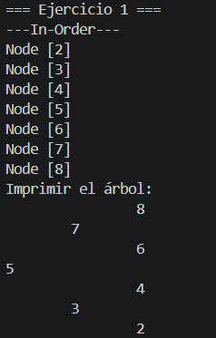
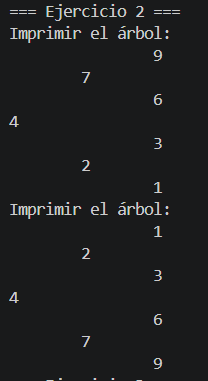
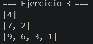
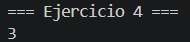

# Practica: Estructuras No Lineales
## Datos:
- Nombre: Juan Cedillo
- Curso: Estructura de Datos
## Implementacion de Arboles
**Descripción:**
Esta práctica implementa algoritmos sobre árboles binarios . Se desarrollaron cuatro ejercicios que tratan de  inserción, inversión, recorrido por niveles y cálculo de profundidad máxima, organizados cada uno en su clase y método correspondiente.

## Ejercicio 1
Dado un arreglo de enteros, se insertan uno a uno en un árbol binario de búsqueda. Se implemento un for para ir sacando dato por dato del arreglo y lo vamos insertado.
Al momento de imprimirlo el metodo lo implemente en el `BinaryTree.java` ya que en el ejercicio 2 lo usaremos
### Codigo
```java
public class Ejercicio1 {
    public void insert (int[] numeros) {
        //CREAMOS ARBOL DE ENTEROS
        //INSERTAR CADA NUMERO
        //IMPRIMIR EL ARBOL

        BinaryTree<Integer> arbol = new BinaryTree<>();
        for(int numero : numeros) {
            arbol.add(numero);
        }

        System.out.println("---In-Order---");
        arbol.inOrder();

        arbol.printTree();
    }
}


public class BinaryTree {
    //Impresion de arbol en estructura horizantal
    public void printTree() {
        System.out.println("Imprimir el árbol:");
        printTreeRecursivo(root, 0);
    }
    private void printTreeRecursivo(Node<T> actual, int nivel) {
        if (actual == null) return;
        
        printTreeRecursivo(actual.getRight(), nivel + 1);
        
        for (int i = 0; i < nivel; i++) {
            System.out.print("\t");
        }
        System.out.println(actual.getValue());
        
        printTreeRecursivo(actual.getLeft(), nivel + 1);
    }
}
```
*Salida Ejercicio 1*



## Ejercicio 2
Dado un árbol binario, el algoritmo intercambia recursivamente el hijo izquierdo y el hijo derecho de cada nodo, haciendose como el espejo del árbol original.
### Codigo
```java
public class Ejercicio2 {
    public Node<Integer> invertTree(Node<Integer> root) {
        if (root == null) return null;
        // intercambiar hijos
        Node<Integer> temp = root.getLeft();
        root.setLeft(root.getRight());
        root.setRight(temp);

        // invertir subárbol izquierdo
        invertTree(root.getLeft());

        // invertir subárbol derecho
        invertTree(root.getRight());
        return root;
    }
}
```
*Salida Ejercicio 2*



## Ejercicio 3
Recorre un arbol por nivel y devuelve una lista de listas, donde cada sublista contiene los nodos de ese nivel. Si el árbol tiene N niveles, se devuelven N listas.

### Codigo
```java
public class Ejercicio3 {
    public List<List<Integer>> listLevels(Node<Integer> root) {
        List<List<Integer>> result = new ArrayList<>();
        if (root == null) return result;

        Queue<Node<Integer>> queue = new LinkedList<>();
        queue.add(root);

        while (!queue.isEmpty()) {
            int size = queue.size();
            List<Integer> level = new ArrayList<>();

            for (int i = 0; i < size; i++) {
                Node<Integer> node = queue.poll();
                level.add(node.getValue());

                if (node.getLeft() != null) queue.add(node.getLeft());
                if (node.getRight() != null) queue.add(node.getRight());
            }

            result.add(level);
        }

        return result;
    }
}
```
*Salida Ejercicio 3*



## Ejercicio 4
En este caso use el metodo de obtener la altura que esta en el `BinaryTree()`, que trata de baja recursivamente hasta los nodos hoja (que retornan 0) y al subir compara cuál rama es más larga con Math.max. Le suma 1 en cada nivel para contar el nodo actual, acumulando así la altura total.
```java
public int getHeight() {
        return getHeightRecursivo(root);
    }

    private int getHeightRecursivo(Node<T> actual) {
        if(actual == null) return 0;
        int heightLeft = getHeightRecursivo(actual.getLeft());     
        int heightRight = getHeightRecursivo(actual.getRight());     
        
        int masAlto = Math.max(heightLeft, heightRight);
        return masAlto + 1;

    }
```

*Salida Ejercicio 4*



## Conclusion
La práctica permitió aplicar árboles binarios en problemas concretos de inserción, inversión, recorrido y cálculo de profundidad. Y el uso de recursión simplifica notablemente la implementación de algoritmos sobre árboles.


